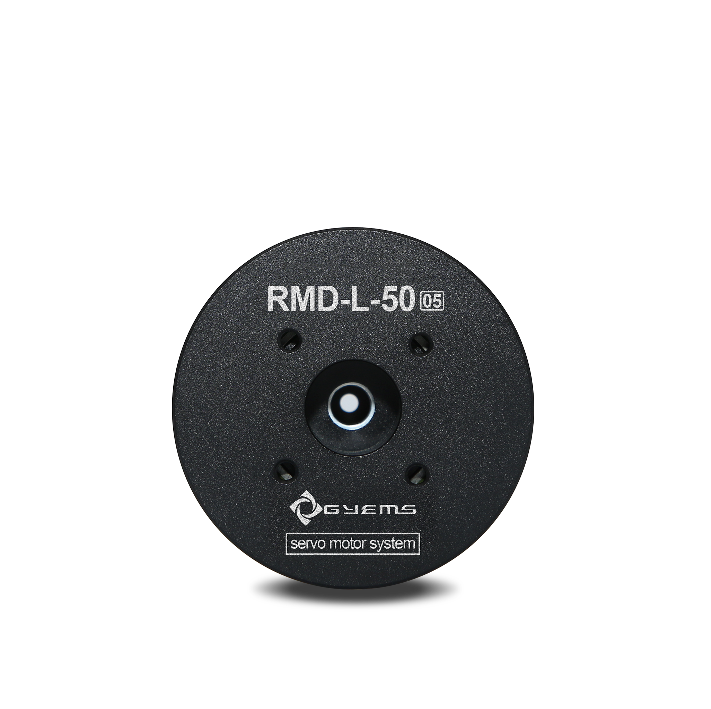
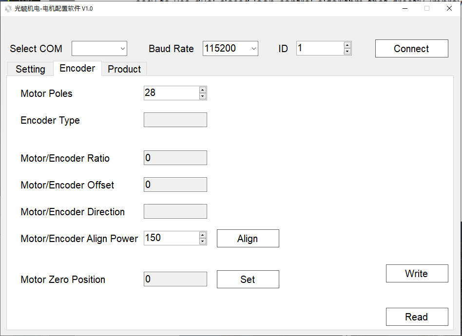
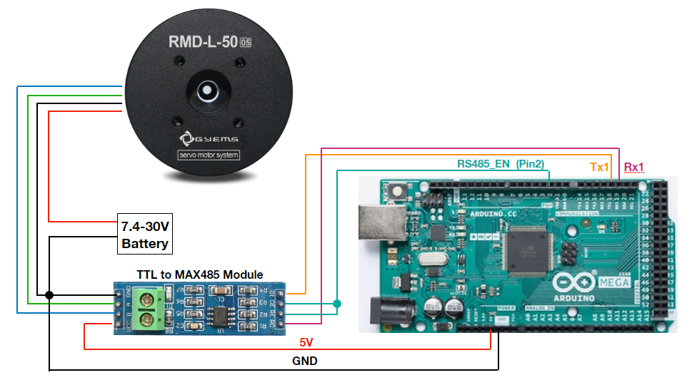
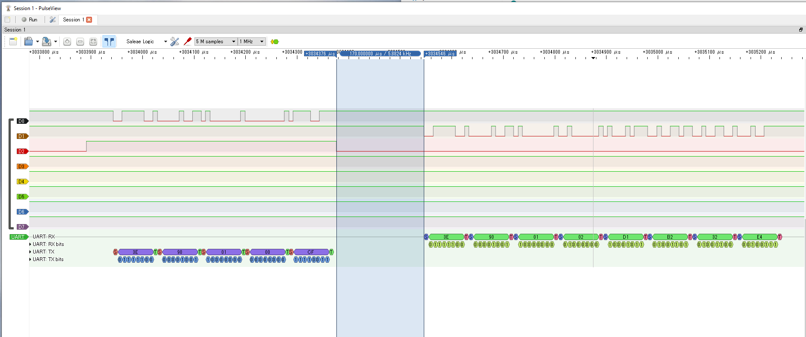

# GYEMS Servo Motor

This servo is a brushless dc servo motor, which communicating via RS485. The servo is controlled by sending a data packt according to the desired control mode. For more detail about this product, please check on "servo motor instruction" file. 

This project, I made an Arduino library to communicate with "RMD-L-70 15" serie. So if you are using a MCU as Arduino or equivalent controller, please feel free to modify and adjust to your application.



# Hardware
1. GYEMS servo motor
2. Arduino MEGA
3. TTL to RS485 module for converting signal
4. RS485 to USB for confif the servo on PC before use
5. Battery (7.0 to 30.0 V)

# Let's start!
First, you may need to config the servo with the software provided from manufacturer [This link](http://www.gyems.cn/support/download), at the moment I was developing this one, the site is Chinese, so try to find the link as specified as "RMD-S Assistant".
After download and install the software, you can follow everthing as the "servo motor instruction" file said, but I will notice you something that you should turn your servo by hand and click set on "Motor Zero Position", try to adjust the servo to make the value of that box as close as zero. This will make your servo read the correct value when the servo reply back from "Read the encoder command" in our control. Then you are almost ready to control this servo!



# Install
Download this repository and copy the whole thing to \Documents\Arduino\libraries\ on your PC, it's the directory of all your downloaded Arduino libraries. If you have all the stuff already, please make a wiring according to this image below



# Source Code and Explanation
First, let me confess that I am not the professional programmer, so the style of coding in mine might not make someone happy, so please be kind to me and understand this, I will try explain as much as I can :)

There are 5 control mode you can play with from this library.
1. SpeedControl(DPS), by passing desired speed in the unit of degree per seconds (DPS) to the function
2. PositionControlMode1(Deg), by passing the desired position in degree, then the servo will turn with maximum speed (720DPS). This is multi turn mode, the servo has maximum rotation as 3600 degrees (10 turns)
3. PositionControlMode2(Deg,DPS), by passing the desired position in degree and desired speed in DPS. This is multi turn mode similar as PositionControlMode1.
4. PositionControlMode3(Deg, Direction), by passing the desired position and direction, the servo will turn with maximum speed (720DPS). This is a single turn mode, so the max value of Deg is 360 and direction can be 0 for clockwise and 1 for counter-clockwise.
5. PositionControlMode4(Deg, DPS, Direction), by passing the desired position, speed and direction as unit specified before. This is a single turn mode, so the max value of Deg is 360.

The servo itself, it just needs byte data which construct as Header and Frame data. The simplest way that I figured out is just using Serial1.write(...HEX...). So if I need 8bytes data I just use Serial1.write() 8 times....as simple as that. This will send the byte data to Tx1 port of Arduino. So to make the servo able to receive this command data from us, we need to set pin2 of the Arduino or the RS485_EN pin to logic HIGH, to make the module knows that we want to send data. From GYEMS.cpp, that part is the code below
```
  byte EncoderCommand = 0x90;
  byte DataLength = 0x00;
  byte DataCheckByte = Header + EncoderCommand + _ID + DataLength;
  
  // send a command to servo to request a current position
  digitalWrite(RS485_EN,HIGH);                            // Pulling the pin 2 HIGH for sending via Tx
  delayMicroseconds(50);                                  // delay a bit before start sending...
  Serial1.write(Header);
  Serial1.write(EncoderCommand);
  Serial1.write(_ID);
  Serial1.write(DataLength);
  Serial1.write(DataCheckByte);
  Serial1.flush();
  digitalWrite(RS485_EN,LOW);                            // Pulling the pin 2 LOW for receving via Rx
  ```
  So `digitalWrite()` is used for that, then start writing the first byte to the last byte. After finish write the data, you may need to `Serial1.flush()` then pull the pin2 to LOW for waiting the reply from servo. I made a capture from my logic analyzer, so you can see that D2 captures the logic of Pin2 of Arduino, D0 and D1 capture Tx1 and Rx1 of Arduino and decode as shown below.
  
  
  
D2 was set to HIGH to let the data send, after the last byte was sent, D2 was set back to low, then around 170 us later , the servo replied back to Rx1 pin as shown. To receive the incoming byte data will need to wait until the data is available and read it, I did it like this code in `ReadReply()` function.
```
while (Serial1.available() > 0)                         // wait for incoming data on Rx
  {
    ReadByte = Serial1.read();                            // read incoming byte
    EncoderReply[i] = ReadByte;                           // store it in array
    i++;
    ReadOK = true;
  }
  if (ReadOK == true)
  {
    EncoderData = Make12BitData(EncoderReply[5],EncoderReply[6]); // byte5 and byte 6 are lo-byte and hi-hyte of encoder data
    CurrentDeg = map(EncoderData,0,4095,0.0,360.0);       // simply convert 12bits data to degree
  }
  return CurrentDeg;
```
So after all data were read, Byte5 and Byte6 are our data of position but we need to consider it as 12bit refer from the instruction. After convert 16bits data to 12 bits the value will be in range of 0 to 4095, then it need to be mapped to 0 to 360 for degree unit.
So if you want to get data of an encoder in degree just call `GetCurrentDEG()`, it does everything from sending request to servo, wait for reply, through the output angle in degree as you want.

If you are working on speed control and want to know the feedback of the speed data, just call `GetAverageSpeed` function. It does the same thing as get encoder data but also estimate the speed until average the speed. This function is a simple idea, if you have anything better than this, please feel free to add your own algorithm.

# Example
Go to the example folder, you will see TestLib.ino , so open that file in Arduino IDE and upload it to your Arduino.
```
#include <GYEMS.h>

int servo1 = 1;     //motorID
float OutputDeg;
float OutputRPM;
float averageDPS;

GYEMS GS(servo1);

void setup() {

  // Initialized serial0 for upload and print data out to screen
  Serial.begin(9600);
  Serial.println("GYEMS Servo was initialized");

  // Uncomment one of these control you want to test with
  GS.SpeedControl(270);
  //GS.PositionControlMode1(180);
  //GS.PositionControlMode2(0,90);
  //GS.PositionControlMode3(45,0x00);
  //GS.PositionControlMode4(90,360,0x01);

}

void loop() {

  //OutputDeg = GS.GetCurrentDEG();       // uncomment to get current angle, if using PositionControlMode1, 2, 3, or 4
  averageDPS = GS.GetAverageSpeed();  // uncomment to get average speed, if using SpeedControl
  
  // Open Serial Monitor to see the value printing out...
  //Serial.println(OutputDeg);      // uncomment to print current angle, if using PositionControlMode1, 2, 3, or 4
  Serial.println(averageDPS);   // uncomment to print average speed, if using SpeedControl
}
```
After include the header file, specify the servo ID, in the `setup()` you may need to call `Serial.begin(9600)` for printing to screen. You can uncomment the control mode you want to test with and see the result on motor and also read the encoder data by uncomment the command in `loop()` according to your control mode, Positon control or Speed control.


